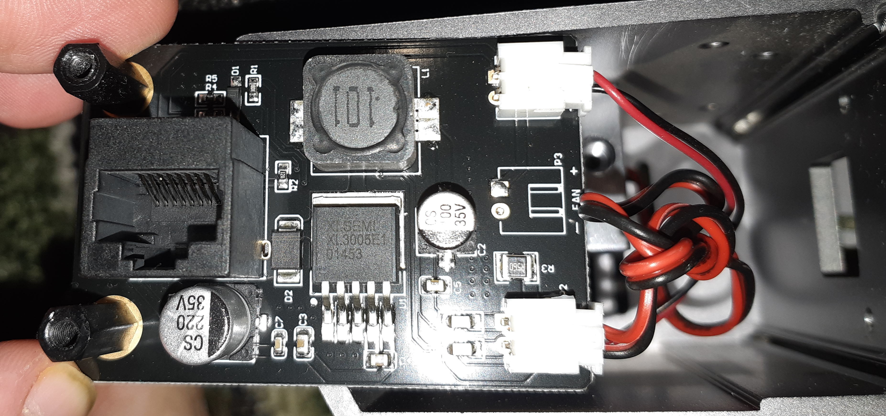
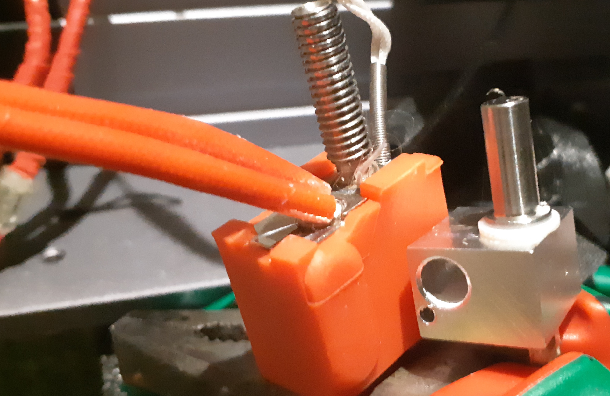
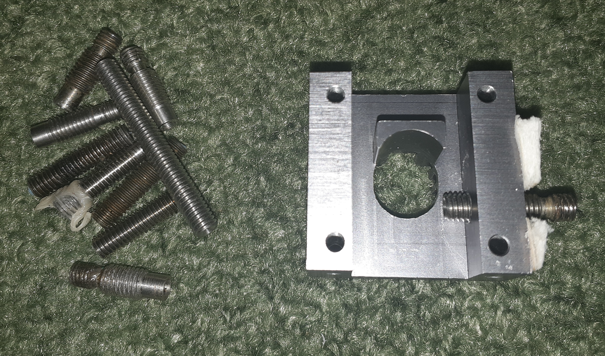
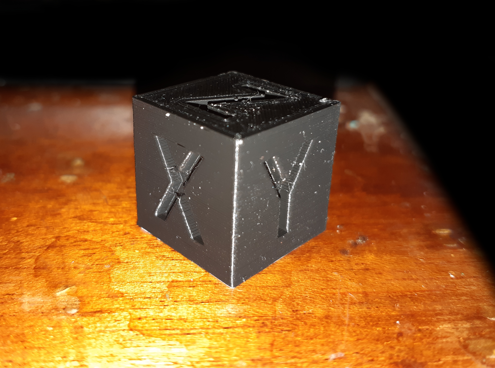

<div id="header" align="center">

<p align="center"></img> </img></p>

  <b>[snapmaker-original]</b>
  
  (Information about this 3D printer (Snapmaker original), set of modifications)
  </br></br>
<div id="badges">
  <a href="https://github.com/denisandroid">
    
  </a>
</div>
</div>

## Description
I have been developing devices similar to 3D printers for a long time, I even created one self-assembling Cartesian printer based on a clipper (stm32f407, rails, belts) practically from scratch and one fine day, while studying a local trading platform, I came across this small and interesting printer. Initially, I was not interested in the quality of its 3D printing (I thought that if it prints, then it is already good), and I was only interested in its CNC capabilities and 3 in 1 technologies (3D, CNC, LASER).

My specific printer was manufactured in 2020-2021, and the printer model itself was first manufactured even earlier, around 2017-2018.

## Disclaimer
The information presented here is solely my opinion and may be both useful and harmful to the end user. All actions described are solely my experience, the end user can repeat my actions only at their own risk. Damage to your device can occur at any stage of the end user's actions. All images presented here are the property of their authors.

Snapmaker is a registered trademark, to which I have no relation, you can always contact the official contacts listed on the website snapmaker.com. All rights reserved.

## Specifications

### Technique

#### Brain

| name | value |
| ---- | ----- |
| cpu | stm32f105 (ARM; Flash: 128kB; 72MHz; SRAM: 64kB) |
| feedback | usb: ch340g (only 115200 boud, or 250000_boud/500000_boud in custom firmware) |
| power unit | 24V 5A (120w) |
| firmware | own firmware 2.11 based on marlin 1.1.0-RC6 (2016-04-24 12:00) |
| gcode | marlin 1.1.0 + own set of instructions |
| drivers | a4988 |

The processor's performance fully covers the printer's capabilities, but the feedback significantly limits it due to the standard data transfer rate of 115200 baud. This is the first printer I know that prints better from a USB flash drive.

#### Meanings and limitations

| name | value |
| ---- | ----- |
| steps per unit | X 400.00, Y 400.00, Z400.00, E92.60 |
| microsteps | 16 |
| maximum feedrates (mm/s) | X 300.00, Y 300.00, Z 5.00, E 25.00 |
| 3d maximum acceleration (mm/s2) | X 1000, Y 1000, Z 100, E 10000 |
| cnc maximum acceleration (mm/s2) | X 100, Y 100, Z 100, E 100 |
| laser maximum acceleration (mm/s2) | X 3600, Y 3600, Z 3600 |
| accelerations printing | 1000.00 |
| accelerations retract | 1000.00 |
| accelerations travel| 1000.00 |
| min feedrate (mm/s) | S0 |
| min travel feedrate (mm/s) | T0 |
| minimum segment time (ms) | B20000 |
| maximum XY jerk (mm/s) | X20.00 |
| maximum Z jerk (mm/s) | Z0.40 |
| maximum E jerk (mm/s) | E5.00 |
| 3d work area | 125x125x125 mm |
| laser work area | 125x125 mm |
| cnc work area | 90x90x50 mm |

The printer manufacturer recommends a default head movement speed of 100 mm/s during printing, and a print speed of 40/50/60 mm/s and a retraction speed of 60 mm/s (at a distance of 5 mm).

The printer has one bad feature in the firmware, namely if you forgot to move the carriage home after printing, and it is in the maximum position (and after printing it is always in the maximum position), then after turning the printer off and on and pressing the home button, you will get a short-term impact of the head on the Z-axis limiter. The impact itself on the Z-axis limiter is not very critical, but very unpleasant and can lead to self-unscrewing.

### Physical
A thick aluminum plate on which the modular guides are located. The modular guides are based on a stepper motor + rigid coupling + four-way trapezoidal shaft, on top of the guide there is a thin aluminum plate with a conventional limit switch. The guides used are absolutely identical to the guides along the X, Y, Z axes, the order of connection to the motherboard determines the belonging of the guide to the desired axis. The moving carriage is held by openbuilds rollers.

#### Accuracy
The design features of the printer and the trapezoid shaft in the guides in combination with the "oak" a4988 should have shown good results, the manufacturer himself assures the accuracy of 50-300 microns. I calibrate each thread for accuracy and enter the data into the slicer, measuring with a caliper with a resolution of 0.01 mm and an error of 0.02 mm. In general, I get:

| NAME | ~PETG | ~PLA |
| ---- | ---- | ----- |
| min absolute deviation (X and Y axes) | 0.02mm | 0.02mm |
| average absolute deviation (X and Y axes) | 0.08mm | 0.12mm |
| max absolute deviation (X and Y axes) | 0.17mm | 0.20mm |

In general, I have summarized many results of different filaments under the general one and described the general deviation of the two axes. I would also like to note that this printer gives more accurate results on the X-axis than on the Y-axis.

<b>The section is not finished yet.</b>

#### Power unit
</img>

A 24V 5A (120W) power supply is used, the reason is unknown, but from the factory this power supply showed 25.2V, in general, an excess of 0.2V is justified, since it allows you to compensate for losses on the wires, but here the excess is as much as 1.2V, which is very bad for the printer's electronics, since all its components (even just fans, heaters) are designed exclusively for 24V. My possible theory is that this excess is most likely done intentionally, since the printer experiences sagging when the heater and table are simultaneously heated by 1.2V.
You can determine the voltage drop simply by the sound of the fans, which are connected directly to 24 V here.

Also, this power supply does not have any cooling capabilities and heats up with prolonged use, but overall it is bearable.

I had an old Mean Well S-150-24 power supply (24V ~6.5A, ~150W) lying around in the bins, not the best choice, but reliable. I set it to 24.2 V and made a double wire to power the printer. As a result, the drop was 0.2 V at the moment of simultaneous heating of the extruder and the table, which suited me quite well.

#### Cooling
Almost all of them use 24V fans, connected directly to 24V, i.e. they are uncontrollable. All fans are absolutely tiny and create a lot of noise, the saddest thing is that they are not very productive and I once managed to catch a traffic jam in the extruder due to not very good weather conditions.

It is recommended to replace almost all fans with larger ones.

#### Display
A very good solution, you can just take it as a phone and control the printer, a display with good resolution and more or less high-quality color gamut, not requiring a stylus. The solution is a ready-made purchased uart solution with its own microcontroller and program. The display is poorly compatible with the standard gcode for text displays and, for example, does not allow much under octoprint. I repeat that this display does not receive an image from the main microcontroller, but is independent.

### 3 In one

#### Extruder (3D)
A classic extruder built on the basis of an unknown to me full-size nemo 17 (42HD4414-07 2020/08/19) from mocotech and gears (factory e-steps 92.60), a radiator noticeably larger than its classic versions, a convenient unknown to me thermal barrier, which involves fastening by screwing in one countersunk screw. By selection, it was established that the heating block itself is E3D V5, but with an unknown to me thermal barrier, which does not imply unscrewing from the block.

A significant drawback of the extruder is the use of a "drop" thermistor instead of a "capsule" one, the sensor itself simply dangles in the heating block. The manufacturer also provided a way to easily remove the lid and unscrew the thermal block, but due to the rigid wires of the heater, the extraction method is not the easiest. Also, if a "plastic plug" accidentally gets into the extruder during printing, you will have to sort out the entire head, and this is a very long and tedious task. Also, the thermal block itself does not have thermal insulation and, in combination with a not very successful PID, the temperatures constantly jump.

#### Bed (3D)
The textolite is small in size (128x128 mm), heating is exclusively resistive (24V, did not determine the power), heating up to 60 degrees is preferable. The main disadvantage of this table is the lack of insulation and all the heat is directed both to the platform itself and to heating its base (guide). Also, the bolts for fastening the platform to the guide are slightly larger than required, because of this, the screws themselves cut into the sticker glued to the platform a little. Another plus is that this sticker does not require any glue at all when printing PLA / PETG.

The first layer is calibrated in the printer very poorly, the calibration of the first layer is more truthful only at the moments of full heating of the platform, which the manufacturer did not provide for in the firmware. After calibrating the surface, you can more clearly evaluate the first layer on the model https://www.thingiverse.com/thing:3797458 (I am not the author of this model, it is simply in the public domain), and then perform the final calibration based on the model.

#### Spindle (CNC)
</img>
</img>

Uses a weak spindle 30W RBI-365024 24V, the main software assumes the use and configuration of specific cutters, the ability to perform drilling was not found. There are many shortcomings, no automatic centering, no speed control, a lot of noise during operation. The spindle control board is supposedly designed for control, but in the copy that I had, the board actually consisted of two resistors that do not assume speed control, there is only on / off control, carried out by the main brain board.

Also one of the minuses - the fastening of cutters / drills is not very good.

#### Laser
</img>

I have hardly used it and have not tested it. There is a dc/dc converter board inside and presumably the feedback and dc/dc regulation works. (will be added).

### Mods

#### Cooling of the thread (3D)
Cooling of the filament during printing is arranged in the strangest way, in general it is enough for someone, but for beginners I recommend printing and using https://www.thingiverse.com/thing:3403426 (I am not the author of this model, it is simply in the public domain)

#### Spool holder (3D)
</img>

The original very small spool could be used further in this printer, but I mainly use full-size plastic spools weighing 1 kg and often encounter feed instability during printing due to uneven movement of the spool along the axis, there are also situations when it is necessary to move the printer from place to place and here situations of falling of the plastic spool are not uncommon. I settled on an open solution https://www.thingiverse.com/thing:3413947 (I am not the author of this model, it is just in the public domain) it prints perfectly on this printer, holds the spool firmly, rotates easily and adjusts to any spool size, the author provided a full original threaded fixation!

Please note that the use of any Teflon guide tubes in the filament flow negatively affects the final prints, in this printer, due to the incorrect angle of the spool, these flow changes are especially noticeable!
It was also recommended that if you do not use this modification, it is better to position the coil counterclockwise, and if with this modification, then clockwise!

#### Thread Spool Holder (3D)
The thread holder allows you to correctly position the thread flow at a certain height, together with the modification of the holder, this is a comprehensive solution. Also, one of the advantages of this holder is that it allows you to easily move the engine control screen to the very top. https://www.thingiverse.com/thing:2757715 (I am not the author of this model, it is simply in the public domain)

#### Strange Y-axis settings
Initially, one oddity was noticed in the printer: if the X and Z axes were correctly limited by software and did not reach the limit, then the Y axis at the possible maximum slightly crashed into an obstacle. In general, this is not critical, since it crashed only one step and there is such a possibility that this is only me, but here is the fix:

```gcode
M1025 X131.00 Y128.00 Z128.00
M500
```
This g-code will determine the maximums for the axes and save the changes.

#### Brain cooling
This is a more or less simple way to replace one of the fans, namely the fan in the brains with a 40mm fan (as far as I remember), in addition to the model itself, you will probably need a 12V converter (if you use a 12V fan) and a dremel to cut out the original plastic from the brains. Here is a printable model https://www.thingiverse.com/thing:6123116 (I am not the author of this model, it is simply in the public domain)

#### Octoprint
</img>

I have long been accustomed to the "klipper" and at the moment I wanted to keep the original brains, but at the same time have the ability to print and control the printer over the network, the simplest solution was to install an octoprint.

There are no special recommendations here, and some parameters may not suit you. (there may also be errors here)

| name | value |
| ---- | ----- |
| name | Snapmaker Original |
| model | Snapmaker Original |
| form factor | Rectangler |
| origin | Lower left |
| heated bed | + |
| width (X) | 125 |
| depth (Y) | 125 |
| height (Z) | 125 |
| axes X | 10000 |
| axes Y | 10000 |
| axes Z | 220 |
| axes E | 1000 |
| nozzle diameter | 0.4 |
| number of extruders | 1 |
| default extrusion length | 5 |

<b>Please note</b> that if you are using 500000 baud, this needs to be specified in the Octoprint alternative speeds, but if you are using 250000 baud, nothing like that is required.

#### UART
</img>

Very weak (115200boud) feedback and high latency do not produce good prints. Eliminating the latency that occurs on USB allows the octoprint to work better and print better, but the 115200 is not defeated yet.

The photo shows the contacts that need to be soldered to use the UART of the single board computer and the microcontroller directly without converting to USB and back.
After soldering the contacts I recommend removing the ch340g chip, but I want to note that you will lose USB support.

<b>These actions are relevant only for the factory firmware</b>, when using firmware at a higher speed (different from 115200) this problem is more or less eliminated by the firmware "32Base_2_11_01Demo250000BOUD.Bin". The problem is completely eliminated on the firmware "32Base_2_11_04Demo500000BOUDAndMoreSerialMods.bin" with an active "buffer buddy" (plugin on octoprint) and can be used with a usb dongle, but 500000 baud may not suit everyone and you can use a simpler one without special corrections "32Base_2_11_01Demo250000BOUD.Bin" at 250000 baud.

#### Volcano (3D)
At first I wasn't too keen on using the stock hotend but surprisingly it printed very well, an extra hotend was included in the spares and after catching the plastic plug again (but this time due to an Octoprint software bug the filament just popped out) and using the extra hotend I didn't want to go out and buy the original hotend or try to burn and oxidize it, I wanted something new.

</img>

After digging through my spares and finding two Volcano aluminum hotends with a silicone sock, a temperature sensor (already in the sleeve) and a heater from Triangle Lab I started thinking about adapting the stock extruder to the Volcano!

</img>

The first thing I ran into was the inability to use the standard bimetal thermal break, thermal breaks are essentially a transition from a large thread diameter to a small one and this hotend was designed with one diameter and no threads along the entire length. And even after cutting the threads in the radiator (while maintaining the ability to use the original thermal blocks), I was able to screw only a bimetallic thermal barrier into the original radiator, and that from the other side. After digging around, I found a thermal barrier with a thread that has the same diameter along its entire length, but is still a thermal barrier. In the future, I will need to order a thermal barrier with half a thread and half without a thread. In general, the diameter could be increased in the original radiator, but I decided to leave the option of using the original block.

</img>

Having measured the distance, I installed the thermal barrier and began to assemble the hotend using fum tape and thread lock. The main difficulty in installing the hotend was the complexity of placement, oddly enough, there was a partition in the extruder head that interfered with the installation of the radiator, and the extruder became several times longer, but the solution was the simplest - slightly grind down the edge of the radiator or install the radiator, but using the space from the other edge of the head.

</img>
</img>

And so, having assembled this strange creation, I started installing and testing it, and my terrible expectations were justified... the extruder simply crashed into the platform, I had to raise the Y-axis to maintain the original length, temporarily putting washers under it and adjusting the height, I determined a convenient size for myself (in the future I will need something made of metal with the right dimensions) for testing.

</img>
</img>

And then I had to set it up for a long time, the extruder became many times longer, I had to make sure that the steps and flow rate settings were correct, I also had to make sure that the temperature sensor readings were correct, since it was not the original one, the firmware supports PID autocalibration, but I was unable to achieve constant readings, and the original PID generally suited me.

</img>

According to the tests, the extruder began to heat up many times longer, and the correctness of the readings was also unclear. Having printed the first test calibration models, I was convinced of the strangeness of the extrusion, if earlier it was necessary to reduce the feed to 98% (with the standard 100%), now according to the tests the feed had to be increased to 101%, which is strange, and the models became worse, and some even better, and the quality of the output plastic filament became many times better. I also had to recalibrate the surface, since the extruder itself is on a screw connection (inaccuracies in parallelism relative to the "bed") and the Y axis was previously increased. After recalibrating the "bed" I managed to lower the fan lower and faced the fact that printing always ended with complete detachment of the model, after a long recalibration of the model it turned out that the standard 205/200 (first layer and final layer) degrees are not enough for printing PLA, I had to increase the temperature to 220 and 217 (at 215 the extruder has a hard time), which gave generally good prints.

</img>

#### Gaps in the guides
The Y-guide design is not very good and involves large gaps through which debris can get in and affect the trapezoid screws; from time to time, various debris can get in there, including bolts or nuts (which, by the way, once happened to me), and especially considering that the manufacturer also assumes milling on this printer, the issue of debris is very acute.

There was a solution on the Internet using a paper accordion filter, which in theory can be made by yourself and the necessary parts can be printed for it https://www.thingiverse.com/thing:2828419 (I am not the author of this model, it is simply in the public domain), at the moment I have not used this modification.

#### TMC2209?
In general, it would be possible to simply desolder the a4988 with a hair dryer and replace them with tmc2209, since they have similar pinout, and also change the harness a little and maybe even run the setup via uart and sensorless pointing, but at the moment I decided not to do this. The reason for using tmc2209 is simple, it is the ability to greatly reduce the noise of the stepper motors, but the StealthChop algorithm can also cause problems with circular geometry, and because of the a4988, the stepper motors are very noisy even in standby mode.

#### Klipper?
Yes, this printer and this motherboard can be upgraded with Klipper, and I have most of the equipment to do it now, but I'm not doing it yet because I want to try a more original CNC and laser.

#### Cura
In general, you can use Luban, it has good settings for this printer on the old Cura engine, but it has a simpler setup interface and in some places even more thought out than Cura, but very limited in functionality. Or a completely different slicer, but I adapted specifically Cura.

| name | value |
| ---- | ----- |
| X (width) | 125.0 |
| Y (width) | 125.0 |
| Z (height) | 125.0 |
| Build plate shape | Rectangler |
| Origin at center |  |
| Heated bed | + |
| Heated build volume |  |
| G-code flavor | Marlin |
| X min | -20 |
| Y min | -10 |
| X max | 10 |
| Y max | 10 |
| Gantry Height | 125.0 |
| Number of Extruders | 1 |
| Apply Extruder offsets to gcode | + |

Start G-code
```gcode
M1005

T0
M82 ;absolute extrusion mode
;Start GCode begin
M104 S{material_print_temperature_layer_0} ;Set Hotend Temperature
M140 S{material_bed_temperature_layer_0} ;Set Bed Temperature
G28 ;home
M400 ; WAIT END G0/G1
M109 S{material_print_temperature_layer_0} ;Wait for Hotend Temperature
M190 S{material_bed_temperature_layer_0} ;Wait for Bed Temperature
G90 ;absolute positioning
G0 X-10 Y-10 F3000
G0 Z0 F1800
G92 E0
G1 E25 F190 ; Extrusion
G92 E0

G0 X0 Y0 F3000 ;Move to origin
G0 Z1 F1800 ;Move up to avoid scraping against heated bed

;Start GCode end
```

End G-code
```gcode
M140 S0
M107
;End GCode begin
M400 ; WAIT END G0/G1
M104 S0 ;extruder heater off
M140 S0 ;heated bed heater off (if you have it)
G90 ;absolute positioning
G92 E0
G1 E-1 F300 ;retract the filament a bit before lifting the nozzle, to release some of the pressure
G1 Z125 E-1 F3000 ;move Z up a bit and retract filament even more
G1 X0 F3000 ;move X to min endstops, so the head is out of the way
G1 Y125 F3000 ;so the head is out of the way and Plate is moved forward
;End GCode end
M82 ;absolute extrusion mode
M104 S0
;End of Gcode
```

| name | value |
| ---- | ----- |
| Nozzle size | 0.4 |
| Compatible material diametr | 1.75 |
| Nozzle offset X | 0.0 |
| Nozzle offset Y | 0.0 |
| Cooling Fan Number | 0.0 |
| Extruder Start G-code duration | 0.0 |
| Extruder End G-code duration | 0.0 |

Next, I recommend installing `Cura-MaterialSettingsPlugin` or a similar plugin to distribute settings between the filament and the printer profile.

In the files I will attach a print profile adapted for this printer (but I have a "volcano") and an example of settings for one of the types of plastic.

<b>The section is not finished yet.</b>

#### My configuration for 2025

| name | value |
| ---- | ----- |
| heat block | Volcano Plated Copper with insulator (TriangleLab) |
| heater | 24V 40W (TriangleLab) |
| sensor | 104NT-4 R025H42G in the sleeve (TriangleLab) |
| nozzle | E3D Volcano (TriangleLab) |
| thermal barrier | unknown |

## General impressions
</img>
</img>

I liked the printer first of all for its assembly, it is completely aluminum, there are very few plastic parts, the printer creators even used thread locks and the idea of ​​3 in one is very catchy, but it has a very strong drawback, namely NOISE, which can be reduced by modifying the fans and ultimately the drivers, spindle...

As for the price, it turned out that this printer did not cost me that much, since the authors cut it out of their line, but at the same time, if I needed 3D printing, I could have initially bought something similar fast on "klipper".
