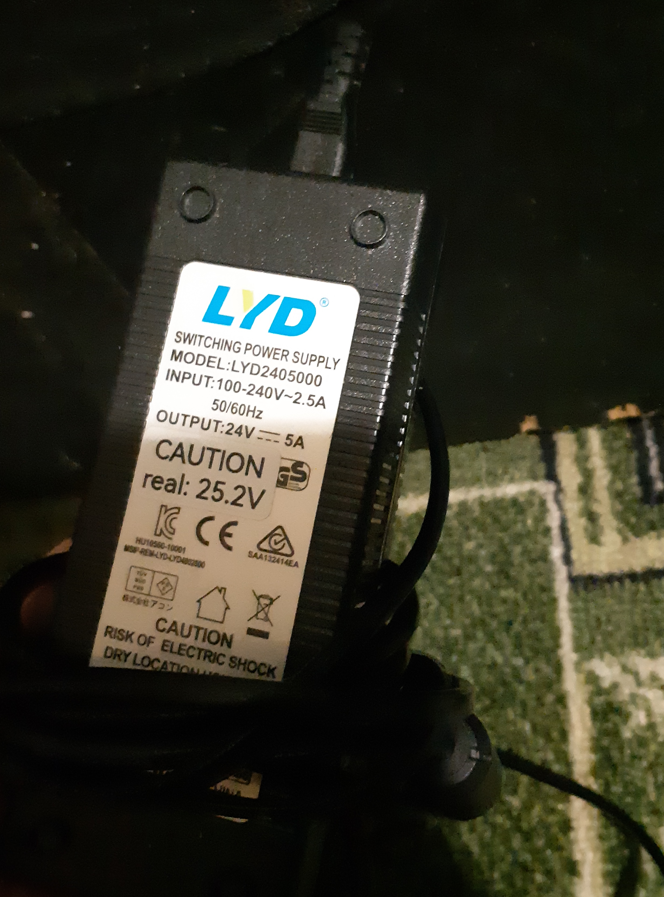

#### Power unit
</img>

A 24V 5A (120W) power supply is used. The reason for this choice is unclear, but out of the box, it delivered 25.2V. While a 0.2V overhead can be justified to compensate for voltage drop across the wiring, a 1.2V excess is significant and potentially harmful to the electronics, as components like fans and heaters are rated strictly for 24V. My theory is that this was intentional to offset the 1.2V sag that occurs when the hotend and heatbed are heating simultaneously. You can even hear the voltage drop by the change in fan pitch, as they are wired directly to the 24V rail.

Furthermore, this stock PSU is passively cooled and gets quite hot during long prints, though it remains functional.
I happened to have an old Mean Well S-150-24 (24V ~6.5A, 150W) in my spare parts bin. It’s not the most modern choice, but it's reliable. I adjusted it to 24.2V and used double wiring to power the printer. Now, the voltage drop is only 0.2V under full load, which is perfectly acceptable.
