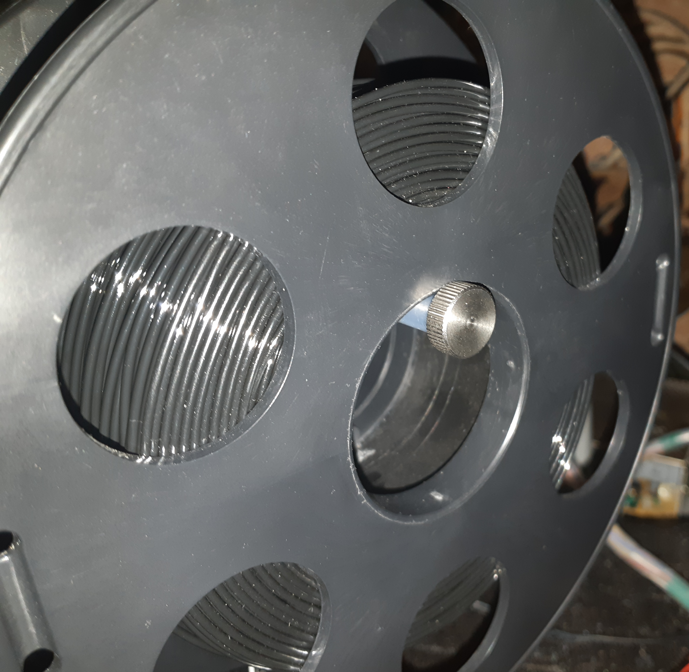

#### Spool holder (3D)
</img>

The original very small spool could be used further in this printer, but I mainly use full-size plastic spools weighing 1 kg and often encounter feed instability during printing due to uneven movement of the spool along the axis, there are also situations when it is necessary to move the printer from place to place and here situations of falling of the plastic spool are not uncommon. I settled on an open solution https://www.thingiverse.com/thing:3413947 (I am not the author of this model, it is just in the public domain, <a href="https://creativecommons.org/licenses/by/4.0/">Creative Commons - Attribution license</a>) it prints perfectly on this printer, holds the spool firmly, rotates easily and adjusts to any spool size, the author provided a full original threaded fixation!

Please note that the use of any Teflon guide tubes in the filament flow negatively affects the final prints, in this printer, due to the incorrect angle of the spool, these flow changes are especially noticeable!
It was also recommended that if you do not use this modification, it is better to position the coil counterclockwise, and if with this modification, then clockwise!

