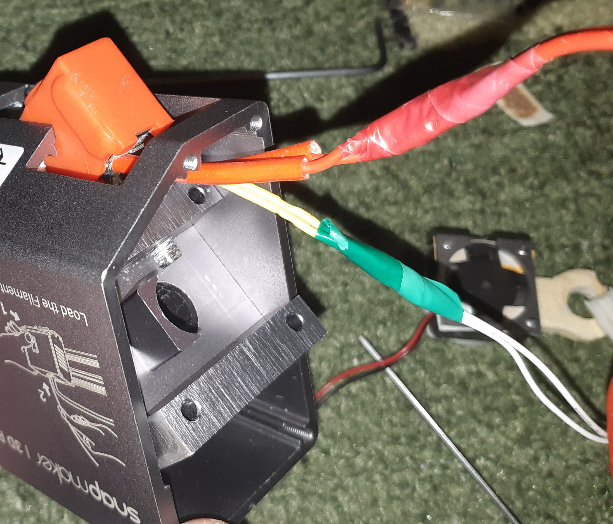
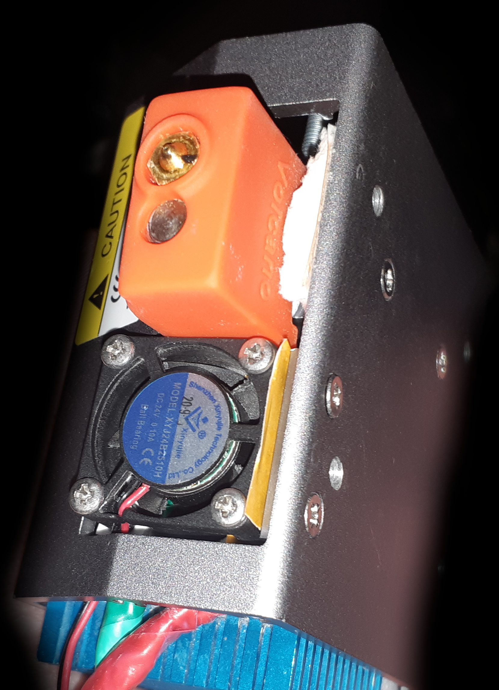
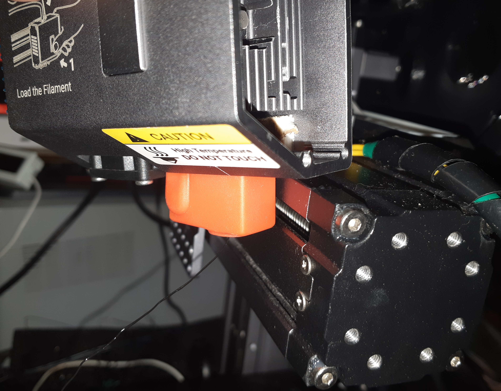
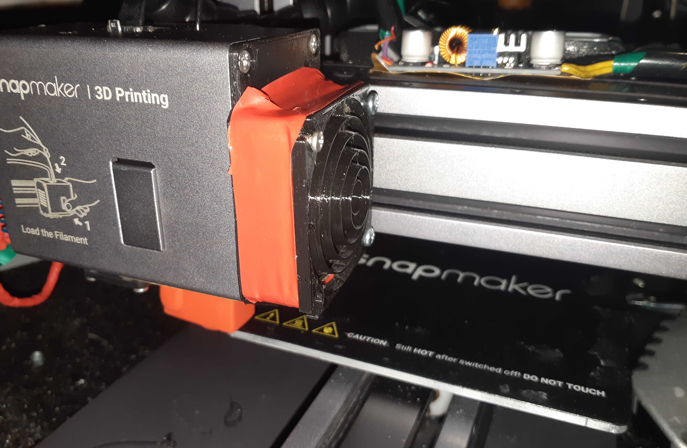

#### Volcano (3D)

At first I wasn't too keen on using the stock hotend but surprisingly it printed very well, an extra hotend was included in the spares and after catching the plastic plug again (but this time due to an Octoprint software bug the filament just popped out) and using the extra hotend I didn't want to go out and buy the original hotend or try to burn and oxidize it, I wanted something new.

</img>

After digging through my spares and finding two Volcano aluminum hotends with a silicone sock, a temperature sensor (already in the sleeve) and a heater from Triangle Lab I started thinking about adapting the stock extruder to the Volcano!

</img>

The first thing I ran into was the inability to use the standard bimetal thermal break, thermal breaks are essentially a transition from a large thread diameter to a small one and this hotend was designed with one diameter and no threads along the entire length. And even after cutting the threads in the radiator (while maintaining the ability to use the original thermal blocks), I was able to screw only a bimetallic thermal barrier into the original radiator, and that from the other side. After digging around, I found a thermal barrier with a thread that has the same diameter along its entire length, but is still a thermal barrier. In the future, I will need to order a thermal barrier with half a thread and half without a thread. In general, the diameter could be increased in the original radiator, but I decided to leave the option of using the original block.

</img>

Having measured the distance, I installed the thermal barrier and began to assemble the hotend using fum tape and thread lock. The main difficulty in installing the hotend was the complexity of placement, oddly enough, there was a partition in the extruder head that interfered with the installation of the radiator, and the extruder became several times longer, but the solution was the simplest - slightly grind down the edge of the radiator or install the radiator, but using the space from the other edge of the head.

</img>
</img>

And so, having assembled this strange creation, I started installing and testing it, and my terrible expectations were justified... the extruder simply crashed into the platform, I had to raise the Y-axis to maintain the original length, temporarily putting washers under it and adjusting the height, I determined a convenient size for myself (in the future I will need something made of metal with the right dimensions) for testing.

</img>
</img>

And then I had to set it up for a long time, the extruder became many times longer, I had to make sure that the steps and flow rate settings were correct, I also had to make sure that the temperature sensor readings were correct, since it was not the original one, the firmware supports PID autocalibration, but I was unable to achieve constant readings, and the original PID generally suited me.

</img>

According to the tests, the extruder began to heat up many times longer, and the correctness of the readings was also unclear. Having printed the first test calibration models, I was convinced of the strangeness of the extrusion, if earlier it was necessary to reduce the feed to 98% (with the standard 100%), now according to the tests the feed had to be increased to 101%, which is strange, and the models became worse, and some even better, and the quality of the output plastic filament became many times better. I also had to recalibrate the surface, since the extruder itself is on a screw connection (inaccuracies in parallelism relative to the "bed") and the Y axis was previously increased. After recalibrating the "bed" I managed to lower the fan lower and faced the fact that printing always ended with complete detachment of the model, after a long recalibration of the model it turned out that the standard 205/200 (first layer and final layer) degrees are not enough for printing PLA, I had to increase the temperature to 220 and 217 (at 215 the extruder has a hard time), which gave generally good prints.

</img>

#### VolcanoRaiseZ-Axis
To install the Vulcan hotend modification, you need to raise the Z-axis. You can use my <a href="./VolcanoRaiseZ-Axis.stl">model</a>, and it's best printed in PETG (note that my model was adjusted to fit my printer; always check carefully, otherwise the nozzle will hit the platform. If you notice that the height isn't enough, adjust the Z-axis in the model in the slicer!).

## License

These STL model (VolcanoRaiseZ-Axis.stl) are licensed under the **Creative Commons Attribution-NonCommercial 4.0 International (CC BY-NC 4.0)** license.

You are free to:
- Print and use this model for non-commercial purposes
- Modify and adapt the model
- Share derivative works, provided the terms are respected

Under the following terms:
- You must give proper credit to the original creator — **#UlinProject** or **Denis Kotlyarov**
- You may not use the model or its derivatives for commercial purposes without explicit permission

Full license text: [CC BY-NC 4.0 Legal Code](https://creativecommons.org/licenses/by-nc/4.0/legalcode)

