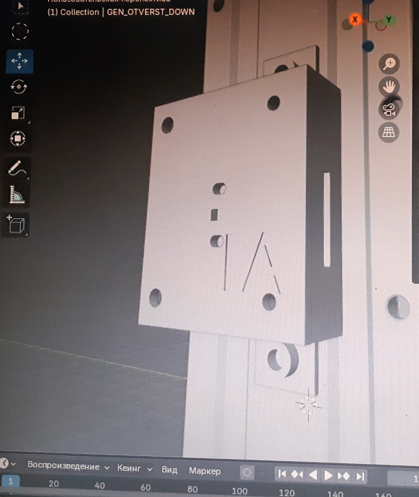
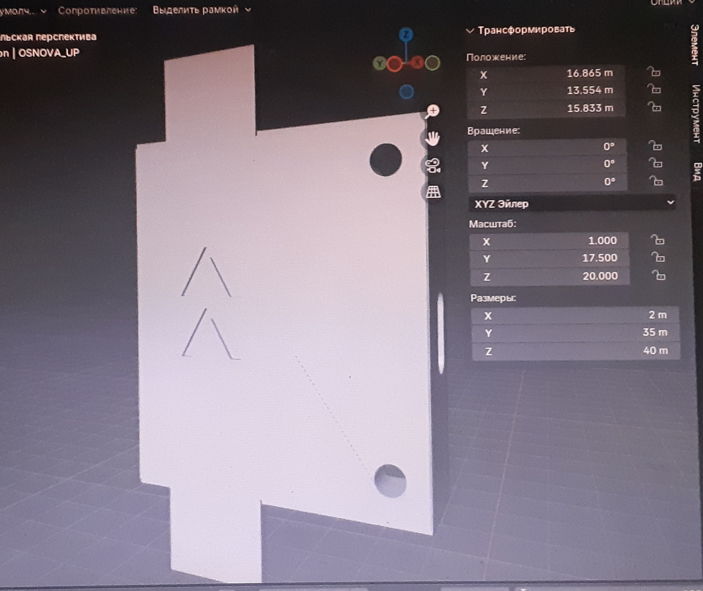
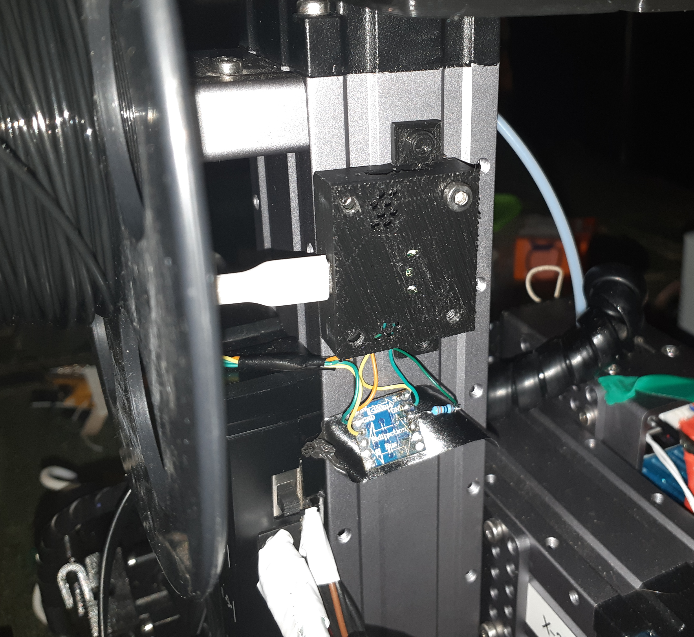
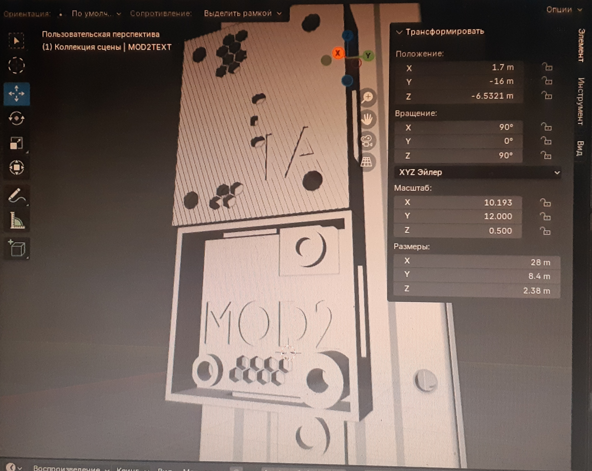
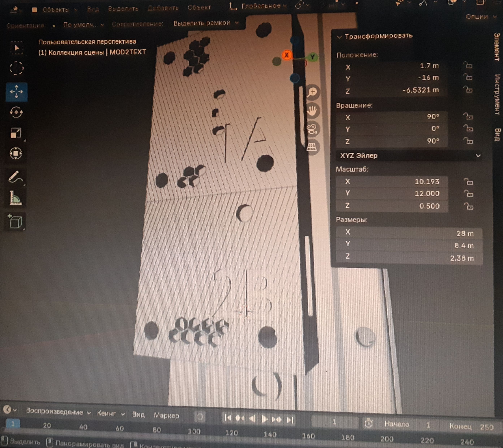

### rp2040snapcase

Addition of a miniature rp2040 microcontroller for interaction and control of additional functions via klipper firmware. The case itself is equipped with the possibility of further expansion and attachment to the beam, as well as an additional case for modifications. The screws that attach the case to the beam can be either countersunk or standard (but then they will be outside the cover). The parts can be printed on the same printer.

#### # 1A

</img>
</img>
</img>
</img>
</img>

#### # 2A

</img>
</img>
</img>

## Files

- <a href="./MCU_BOTTOM.stl">MCU_BOTTOM.stl</a> - the housing in which the microcontroller is installed.
- <a href="./MCU_TOP.stl">MCU_TOP.stl</a> - the top cover closes the housing in which the microcontroller is located.
- <a href="./MOD2_BOTTOM.stl">MOD2_BOTTOM.stl</a> - a housing that can be attached to the main body and accommodate additional modifications
- <a href="./MOD2_TOP.stl">MOD2_TOP.stl</a> - the cover closing the additional housing

## License

These STL models (MCU_BOTTOM.stl, MCU_TOP.stl, MOD2_BOTTOM.stl, MOD2_TOP.stl) are licensed under the **Creative Commons Attribution-NonCommercial 4.0 International (CC BY-NC 4.0)** license.

You are free to:
- Print and use this model for non-commercial purposes
- Modify and adapt the model
- Share derivative works, provided the terms are respected

Under the following terms:
- You must give proper credit to the original creator — **#UlinProject** or **Denis Kotlyarov**
- You may not use the model or its derivatives for commercial purposes without explicit permission

Full license text: [CC BY-NC 4.0 Legal Code](https://creativecommons.org/licenses/by-nc/4.0/legalcode)
