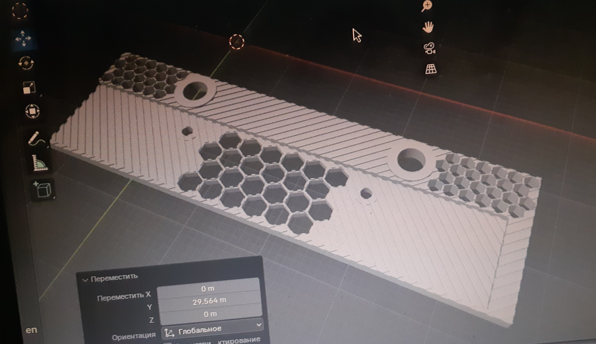
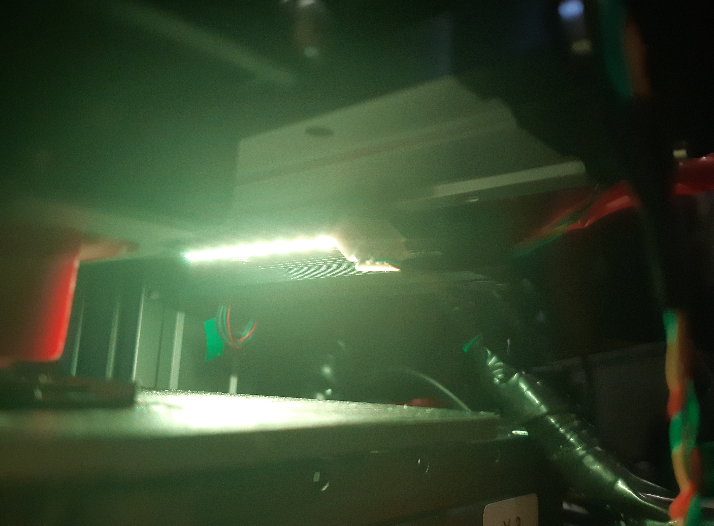
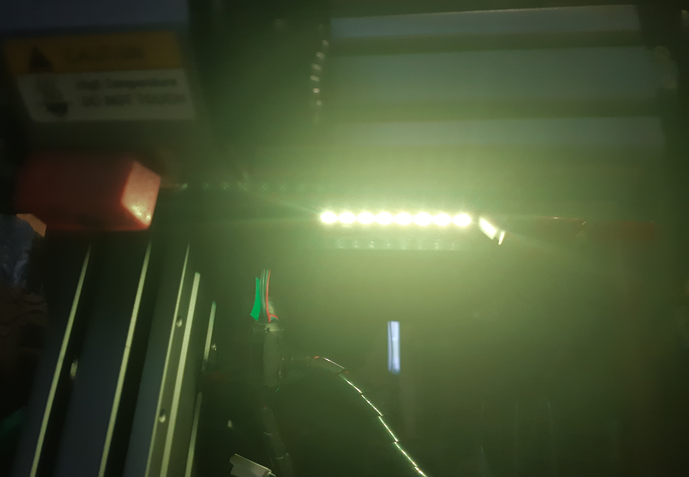

### ws2812b.stl
Useful <a href="./ws2812b.stl" width="11%">3d model</a> for attaching a small piece of ws2812b tape (5v version) on a PCB to a beam. Lighting control is best done with an additional controller (like rp2040) and a 5v logic level converter.

</img>
</img>
</img>

## License

This <a href="./ws2812b.stl" width="11%">STL model</a> is released under the **Creative Commons Attribution-NonCommercial 4.0 International (CC BY-NC 4.0)** license.

You are free to:
- Print and use this model for non-commercial purposes
- Modify and adapt the model
- Share derivative works, provided the terms are respected

Under the following terms:
- You must give proper credit to the original creator — **#UlinProject** or **Denis Kotlyarov**
- You may not use the model or its derivatives for commercial purposes without explicit permission

Full license text: [CC BY-NC 4.0 Legal Code](https://creativecommons.org/licenses/by-nc/4.0/legalcode)
