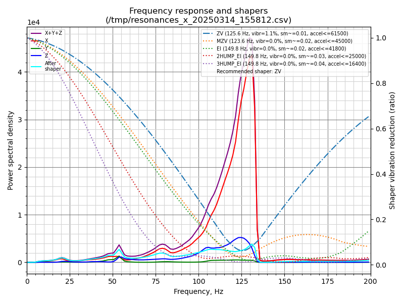
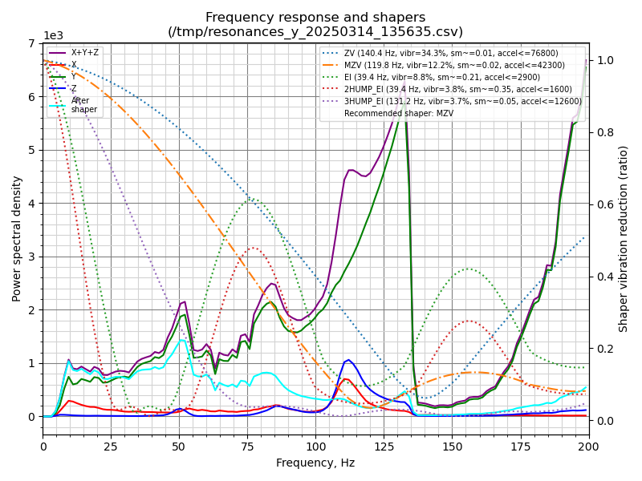

#### Resonance compensation (only for klipper firmware)

## Description
It seems that this is exactly what this printer lacked from the factory. The printer itself has very good indicators on the X axis from the factory, but with the Y axis, not everything is so good even according to accuracy tests, after this calibration, the printer accuracy has increased significantly and it became possible to increase the acceleration, as well as print at higher speeds. I do not recommend making such accelerations as recommended by autocalibration, start from the fact that the acceleration from the factory is 1500 (on printing) / 3000 (on the laser), you can use 3000/6000 on printing, and maybe more, but I do not recommend you to set 76800/61500 right away, this is too much, remember that due to the features of the printer (trapezoidal shafts) the printer is subject to strong friction, you can thus wear out this printer very quickly, and I also recommend that you lubricate it more often.

## My results (Demo01)
</img>

</img>

X:
```
Fitted shaper 'zv' frequency = 125.6 Hz (vibrations = 1.1%, smoothing ~= 0.015)
To avoid too much smoothing with 'zv', suggested max_accel <= 61500 mm/sec^2
Fitted shaper 'ei' frequency = 149.8 Hz (vibrations = 0.0%, smoothing ~= 0.018)
To avoid too much smoothing with 'ei', suggested max_accel <= 41800 mm/sec^2
Fitted shaper '2hump_ei' frequency = 149.8 Hz (vibrations = 0.0%, smoothing ~= 0.028)
To avoid too much smoothing with '2hump_ei', suggested max_accel <= 25000 mm/sec^2
Fitted shaper '3hump_ei' frequency = 149.8 Hz (vibrations = 0.0%, smoothing ~= 0.040)
To avoid too much smoothing with '3hump_ei', suggested max_accel <= 16400 mm/sec^2
Fitted shaper 'mzv' frequency = 123.6 Hz (vibrations = 0.0%, smoothing ~= 0.017)
To avoid too much smoothing with 'mzv', suggested max_accel <= 45000 mm/sec^2
```

Y:
```
Fitted shaper 'zv' frequency = 140.4 Hz (vibrations = 34.3%, smoothing ~= 0.013)
To avoid too much smoothing with 'zv', suggested max_accel <= 76800 mm/sec^2
Fitted shaper 'mzv' frequency = 119.8 Hz (vibrations = 12.2%, smoothing ~= 0.018)
To avoid too much smoothing with 'mzv', suggested max_accel <= 42300 mm/sec^2
Fitted shaper 'ei' frequency = 39.4 Hz (vibrations = 8.8%, smoothing ~= 0.208)
To avoid too much smoothing with 'ei', suggested max_accel <= 2900 mm/sec^2
Fitted shaper '2hump_ei' frequency = 39.4 Hz (vibrations = 3.8%, smoothing ~= 0.348)
To avoid too much smoothing with '2hump_ei', suggested max_accel <= 1600 mm/sec^2
Fitted shaper '3hump_ei' frequency = 131.2 Hz (vibrations = 3.7%, smoothing ~= 0.050)
To avoid too much smoothing with '3hump_ei', suggested max_accel <= 12600 mm/sec^2
```

The results are more like the truth, but I'm not entirely sure about them, since these are the very first resonance measurements I made on this printer. The measurement was made directly on the nozzle itself, and on the heated platform at its very edge. What I can say is that the autocalibrator's choice of 1.1% vibrations is very strange, when you can choose 0%, but not at such high accelerations, and I also can't say with certainty that the chosen shaper will help 100%, since there are spikes at different frequencies.


## At the moment I am using this configuration (Demo01)

```toml
[input_shaper]
shaper_type_x: mzv
shaper_freq_x: 123.6
shaper_type_y: 3hump_ei
shaper_freq_y: 131.2
```

Yes, the Y axis is limited to a max of 12600 acceleration, but that seems to be the best the shaper can offer on that axis with minimal vibration.

## How to calibrate?
There are no special recommendations here, I recommend using the official documentation, I will simply tell you how I calibrated this printer. For starters, you can use any high-speed microcontroller, for example, rp2040/rp2350 with an adxl345 accelerometer, I simply used stm32f103 with an adxl345 accelerometer soldered in by myself and flashed it with the latest klipper firmware, one microcontroller with adxl is enough for separate calibration of one axis, and then another, just calibrate one axis and move the calibrator to the other, and then calibrate it too.

### Configuration example
Note the order of the X, Y, Z axes and determine in which axis order you install the accelerometer.
```toml
[mcu mcu2]
serial: /dev/serial/by-id/usb-Klipper_stm32f103xe_25002700010000343333574E-if00
restart_method: command

[adxl345 AXES_X_OR_Y]
cs_pin: mcu2:PA4
spi_speed: 5000000
axes_map: y, x, z
spi_bus: spi1
rate: 3200

[resonance_tester]
accel_chip: adxl345 AXES_X_OR_Y
move_speed: 60
probe_points:
    62.5, 62.5, 20
